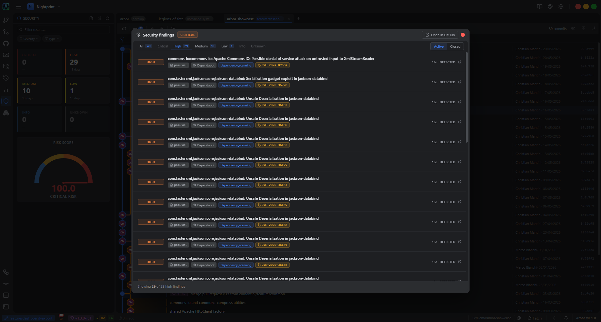
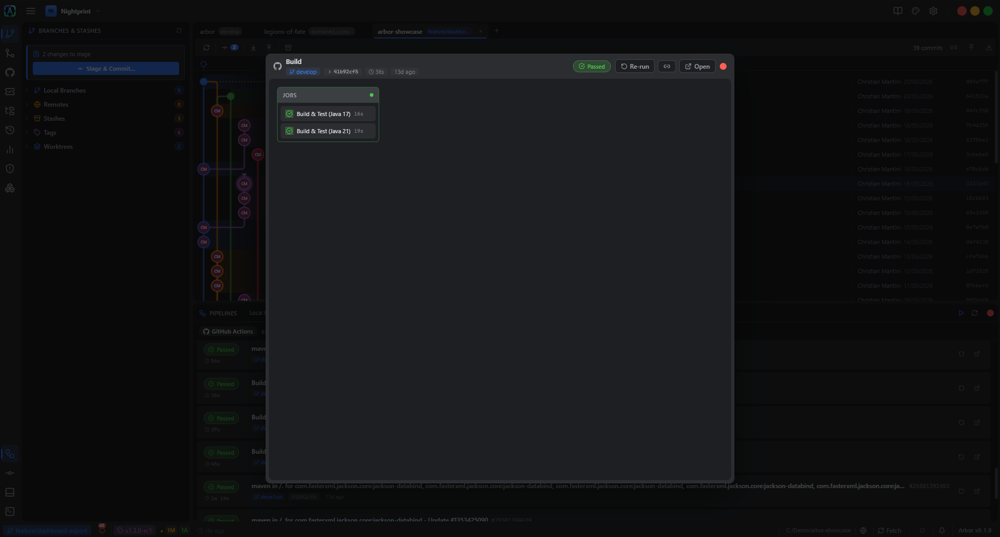
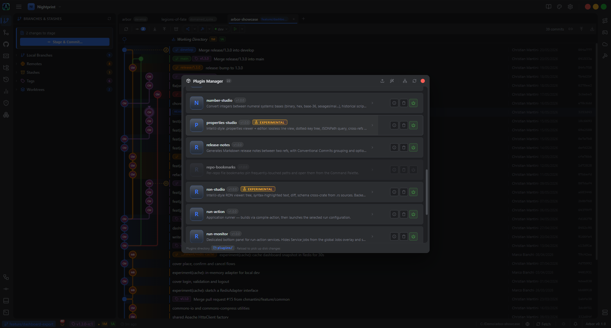
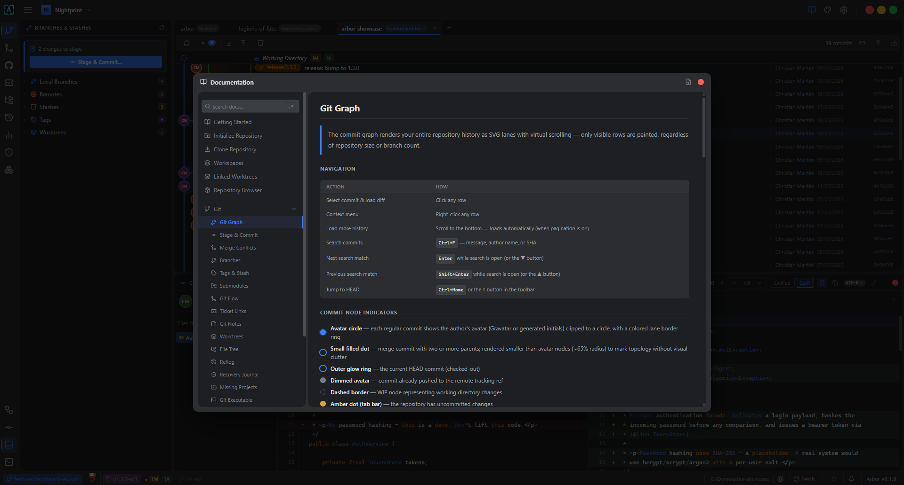

# Arbor

A desktop Git client built on Tauri, Rust, and Svelte. No Electron, no Node.js runtime. The Windows executable is around 40 MB.

[](LICENSE)

[](https://github.com/nightprint-studio/arbor/actions/workflows/release.yml)
[](https://tauri.app)
[](https://svelte.dev)

https://github.com/user-attachments/assets/1cfdec3d-82ab-4f14-a4e8-fb44a160a3e5

## What it covers

Arbor handles the everyday Git workflow (graph, staging, branches, merge, stash, tags, submodules, reflog, bisect, terminal) and the surrounding work that usually lives in browser tabs: CI/CD pipelines, security scanning, pull/merge requests, issue trackers, GitFlow, multi-repo workspaces.

It's also a plugin platform. The same sandboxed Lua runtime hosts tools that sit outside the strict scope of a Git client: format editors (JSON, TOML, YAML, RON, `.properties`), a cloud-storage browser, build runners, source-export workflows, and more. None of these ship in the binary — they're installed on demand from the [arbor-extensions](https://github.com/nightprint-studio/arbor-extensions) marketplace, which is also where most of the "surrounding work" features above live.

The full user manual lives in the app. Open the **Docs** panel from the activity bar; it can be exported to Markdown or HTML on demand. A snapshot is checked in at [docs/arbor-docs.md](docs/arbor-docs.md) for browsing from GitHub.

## Highlights

### Working with code

- **Commit graph.** SVG with virtual scrolling, lane assignment, search, jump-to-commit.
- **Three-way merge editor** with an editable result panel and conflict-by-conflict navigation. Used for merge, stash apply, revert, cherry-pick, and MR conflict resolution.
- **Partial staging** at the line and hunk level.
- **The usual surface:** branches, tags, stash, submodules, reflog, bisect, integrated terminal. Plus a recovery journal that surfaces unreachable commits Git would have garbage-collected.

### Multi-repo

- **Workspaces.** Named, colour-coded groups of repositories with their own tab snapshot. A single repo can belong to multiple workspaces. Bulk *Fetch all*, *Pull all*, and *Tag all* across every member. Import/export workspace definitions as portable JSON.
- **Linked worktrees** keep branches synchronised across multiple unrelated repos via alias groups, useful when a feature spans several repositories.
- **Missing & relocated projects.** When a repo disappears from disk, Arbor tombstones the tab and offers to relocate it instead of failing silently.

### Collaboration

- **Pull/Merge requests.** GitHub PRs and GitLab MRs in a sidebar. Merge/squash/rebase, reopen, close, comments, CI checks panel, file diffs, commit drill-down, and an activity timeline with bot-message tinting and HTML-comment sanitisation.
- **CI / CD.** Live GitHub Actions and GitLab CI runs: status pills, durations, branch/commit chips, stage and job graphs, retrigger, and a *Run pipeline* dialog with branch and variables picker.
- **Security Dashboard.** Vulnerability scanner output from GitLab Vulnerability Report (GraphQL) and GitHub GHAS/Dependabot/Secret Scanning (REST), unified into severity counters, a 0–100 risk gauge, a 30/60/90-day chart (GitLab), and a virtualised findings modal. Active/Closed scope toggle. Per-repo dashboard plus an optional workspace-wide aggregation.
- **Issues.** Linear and Jira integration. Tickets referenced in commit messages are detected automatically and surfaced as clickable links.
- **GitFlow.** Built-in start/finish actions for feature, release, hotfix, and support branches.

### Customisation

- **Theme editor.** Every colour, geometry token, and terminal palette entry is a CSS variable. Edit live, fork built-ins, import/export as JSON. Two built-in themes (Dark and Light) plus 25 presets in `themes/`: Tokyo Night (Night/Storm/Day), Catppuccin (Mocha/Macchiato/Frappé/Latte), Rosé Pine (Main/Moon/Dawn), GitHub (Dark/Light), Dracula, Nord, Solarized (Dark/Light), Gruvbox (Dark/Light), Monokai, One Dark/Light, Ayu (Dark/Light), Kanagawa, Caffeine.
- **Command palette.** `Ctrl+K`. Verb-first: pick *Checkout*, *Merge*, *Delete*, *Push*, then a target (branch, commit, tag, file).
- **Statistics.** Per-repo metrics (commits, contributors, file churn) without leaving the app.

### Plugins

Arbor runs plugins in a sandboxed Lua 5.4 environment. Plugins can register sidebar panels, command-palette entries, activity-bar items, settings panels, keybindings, hooks (commit, push, pre-commit, repo-open, pipeline events, security state changes, and more), background schedulers, and custom forms.

**Nothing ships bundled.** The binary contains only the runtime — every plugin is installed on demand from the [arbor-extensions](https://github.com/nightprint-studio/arbor-extensions) marketplace via the *Browse* button in the Plugin Manager, or from any custom GitHub source you add. The registry itself is just a small list of pointers — each plugin's metadata, icon, and docs are resolved straight from the source repo, so authors only ever maintain their own `plugin.toml`. Installs land disabled by default after an explicit permission-review modal, live in `~/.config/arbor/marketplace_plugins/`, and are version-tracked with an *Update* pill when a newer release shows up in the catalog. A background scheduler keeps the catalog fresh; cadence is tunable from *Settings → Tools → Marketplace*.

The plugin development reference (manifest schema, hooks, full Lua API surface) lives in the in-app Docs panel.

## Screenshots

| | |
|---|---|
|  |  |
| Security dashboard | CI/CD runs and jobs |
|  |  |
| Plugin manager | In-app Docs panel |

## Installation

### Requirements

- **Git 2.48.1** is the version Arbor is developed and tested against. Older releases probably work for the common surface but aren't exercised. A handful of operations (rebase, parts of the submodule lifecycle) delegate to the `git` CLI, where version differences may show up.
- **Microsoft WebView2** is required on Windows. It ships pre-installed on Windows 11 and on recent Windows 10 updates. Older Windows 10 systems may need to install the [Evergreen Runtime](https://developer.microsoft.com/microsoft-edge/webview2/) manually before launching Arbor.
- A C toolchain is required only for building from source. libgit2 and Lua 5.4 are vendored, so no system libraries beyond the toolchain are needed.
- **Language.** The UI ships in **English only**. There's no localisation layer and none is planned for now.

### Tested platform

Arbor is built to run on Windows, macOS, and Linux. Today the only environment actively exercised by the maintainer is **Windows**. The core has no Windows-only code paths, so macOS and Linux builds should work, but bug reports from those platforms are especially welcome since they're the ones least likely to be caught before a release.

### Pre-built binaries

Pre-built binaries for Windows, macOS, and Linux are attached to each [release](https://github.com/nightprint-studio/arbor/releases).

### Build from source

Requires Rust, Node.js, and Yarn:

```bash
git clone https://github.com/nightprint-studio/arbor.git
cd arbor
yarn install
cargo tauri build
```

For a hot-reloading development environment:

```bash
cargo tauri dev
```

### Where Arbor stores its data

| What | Location |
|---|---|
| App config | `~/.config/arbor/config.toml` (Linux) · `~/Library/Application Support/arbor/config.toml` (macOS) · `%APPDATA%\arbor\config.toml` (Windows) |
| Plugins | `…/arbor/plugins/<plugin-name>/` under the same root as the app config |
| Per-repo settings | `.arbor/config.toml` inside the repository |
| Credentials | OS keyring: Windows Credential Manager, macOS Keychain, libsecret on Linux |

Nothing is written outside these locations. There is **no telemetry**: the only outbound network calls are the ones you explicitly configure (GitHub, GitLab, Linear, Jira, cloud-storage providers, and the like).

## Documentation

- [docs/arbor-docs.md](docs/arbor-docs.md) — full user manual, exported from the in-app Docs panel. May lag slightly behind the in-app version.
- [docs/status.md](docs/status.md) — project status: what's stable and what's still experimental.
- [docs/roadmap.md](docs/roadmap.md) — what's planned next.

## Status

Most of Arbor is stable and used day-to-day. A few areas are still settling. See [docs/status.md](docs/status.md) for the per-feature breakdown and [docs/roadmap.md](docs/roadmap.md) for what's coming next.

## Contributing

> **Heads up: pull requests aren't being accepted yet.**
> Arbor is still settling into a public shape. For an initial period I'm keeping merges to maintainers only so the architecture, plugin API, and contribution workflow can stabilise without juggling external patches at the same time. This will be revisited once the dust settles; the moment PRs open up, this section and [CONTRIBUTING.md](CONTRIBUTING.md) will be updated.
>
> **What *is* welcome right now:** bug reports, feature ideas, plugin proposals, design feedback, and questions. Open an [issue](https://github.com/nightprint-studio/arbor/issues) and it'll be read.

Bug reports should mention the platform, the Arbor version, and whether the area involved is listed as stable, functional, or experimental in [docs/status.md](docs/status.md). See [CONTRIBUTING.md](CONTRIBUTING.md) for the full policy.

## License

Arbor is released under the [GPL-3.0](LICENSE) license. Forks and redistributions, including modified versions, must remain open under the same license.

Built with [Tauri](https://tauri.app) and [Svelte](https://svelte.dev). Made by **Nightprint Studio**.
