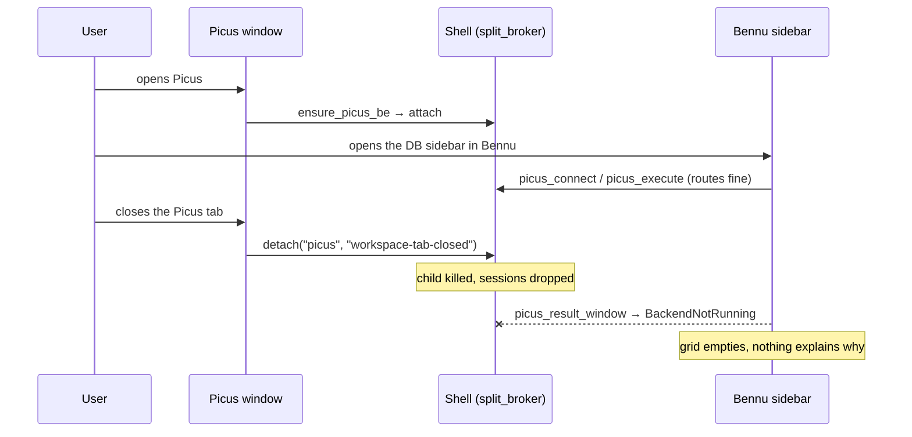
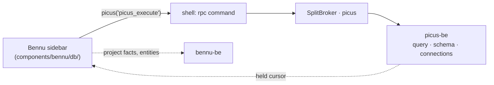
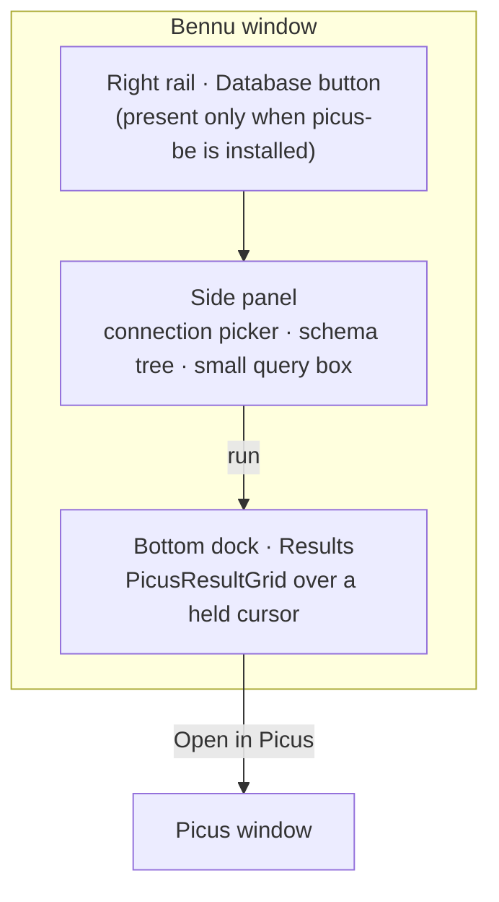

# Bennu ↔ Picus — the database sidebar

> How a Java project gets a live schema and a query box inside the editor, served by
> `picus-be`, without Bennu learning what a database is. For whoever builds it, and for
> whoever has to decide what it must *not* become.

The request is one sentence — *a sidebar in Bennu, visible only when Picus is installed, that
runs queries and one day generates entities from the schema* — and it is three unrelated
engineering questions wearing one coat:

1. **Availability.** What does "installed" mean, mechanically, and who is allowed to answer it.
2. **Lifetime.** Who keeps `picus-be` alive when it has *two* consumers, which is a thing the
   shell cannot express today.
3. **Vantage.** Picus is database-oriented and Bennu is project-oriented. Something has to hold
   the sentence "this project talks to that database", and it is not obvious whose it is.

Only (3) is product design. (1) is twenty lines. (2) is the one that will bite, and it will bite
as a bug report that says *"the grid went empty and nothing said why"*.

---

## 1. "Installed" — what it means and who answers

There is already a mechanical truth in the shell, and it is the only one: `backend_binary()`
(`src-tauri/src/ipc/mod.rs:1387`) looks for `picus-be` beside the launcher (dev) and under
`resources/backends/` (installed), and `ensure_picus_be` logs *"picus-be not available — the
Picus studio stays on its fixtures"* when it does not find it. A build that ships without the
Picus backend is a real, supported state today.

Nothing exposes that to the frontend. `list_running_products` answers **running**, which is a
different question and the wrong one: the rail must decide on its first frame, and *spawning a
database backend to find out whether to draw a button* is exactly the thing not to do.

**Proposal — one command, no new knowledge.**

```rust
/// Which product backends are present on this installation.
///
/// The file-existence answer `backend_binary` already gives, exposed. NOT "is it running":
/// a rail decides what to draw before anything is spawned, and asking by spawning would
/// make drawing a button cost a database process.
#[tauri::command]
pub fn installed_backends(app: AppHandle) -> Vec<String> { … }
```

Frontend: a tiny `productsStore` (`stores/products.svelte.ts`) that loads it once on mount and
re-reads on `arbor://picus-be-up`. Staleness is a non-issue in production (the set cannot change
without reinstalling) and self-heals in development on the first spawn after a rebuild.

**The rail already copes with a button that comes and goes.** `rail-order.ts` documents it as its
first awkward fact: a saved order names ids that are not offered, and they are silently skipped
and *restored in place* when the project offers them again. So the item is simply absent from
`rightTopRaw` when Picus is not installed — the same shape as the existing `javaTools` and
`jspTools` gates, no new mechanism.

> [!WARNING]
> **The panel-orphaning effect already has a fix — extend it, don't rediscover it.**
> `BennuWindow.svelte` runs an `$effect` that closes any open panel whose rail toggle has
> disappeared (a Cargo root losing the Java tools). A `db` panel left open by a profile switch
> onto an installation without Picus would otherwise sit there with no way to close it. The new
> id goes in that effect's list, in the same turn as the rail entry.

---

## 2. Lifetime — the one real landmine

Today **a backend's life is owned by the window with the same name.**

- `window/events.rs:162` — on `Destroyed`, `corvus | merula | sitta | tyto | bennu | picus |
  garrulus` are detached, killing the child.
- `window/workspace.rs:237` — the tabbed container does the same when the product's tab closes.

The comment at that site even names the reason for Picus specifically: *a lingering `picus-be`
would hold live database sessions open with no window to close them from*. That reasoning is
correct and it is exactly what breaks when a second consumer exists.



And the mirror image is just as bad: if **Bennu** brings `picus-be` up and Bennu closes, nothing
tears it down — the close handler only detaches the product whose window it is. An orphan
`picus-be` then holds open database sessions with no window anywhere, which is precisely the
state the existing comment says must not happen.

> [!CAUTION]
> **A refcount in `split_broker` is the price of any cross-product embedding, and it is due now.**
> Not as part of "the sidebar feature" — as the thing that makes the sidebar *possible* without
> a silent failure mode. Every future embedding (Corvus wanting a Garrulus note, Sitta wanting a
> Bennu outline) hits the same wall.

**Shape.** `split_broker` keeps a `HashMap<&'static str, HashSet<String>>` of holders beside
`OOP`:

```rust
pub fn retain(program: &'static str, holder: &str);   // spawn if this is the first holder
pub fn release(program: &str, holder: &str);          // detach only when the last one goes
```

Holders are strings that name a *reason*, not a caller: `"window:picus"`, `"bennu:db-sidebar"`.
The window-close path calls `release(id, "window:picus")` instead of `detach`, so behaviour with
one consumer is byte-identical to today. Two Tauri commands (`retain_backend` / `release_backend`)
let the frontend hold one — **on `spawn_blocking`, always** (backend-architecture landmine #1:
`ensure_*_be` parks on framed IPC and Picus resolves its password over the reverse channel, so a
runtime worker held here deadlocks the shell and blanks every window).

Bennu retains on the first open of the sidebar and releases on window unload. It does **not**
retain merely because Picus is installed: an editor that spawns a database backend for a project
with no connection bound has spent a process on nobody's behalf.

Rejected alternative: *let Bennu listen for `arbor://picus-be-down` and re-spawn*. It turns the
user's deliberate "close Picus" into a resurrection, and the held cursors are gone regardless —
so the user pays for a respawn and still loses their grid.

---

## 3. The seam — and the handler that must never be written

The frontend RPC bridge is already generic: `rpc(program, method, params)`, with
`picus()` bound in `ipc/rpc.ts` and the typed wrappers sitting in `ipc/picus/db.ts`. Bennu's
sidebar calls `picus-be` **directly from the frontend**. No new Rust in `bennu-be`, no new method
names, no second copy of the result types.



> [!IMPORTANT]
> **Do not add `bennu_db_query` to `bennu-be`.**
> A proxy handler would create a second seam with its own error vocabulary, and *the error
> strings are the contract* (backend-architecture landmine #3): a `BackendNotRunning` from Picus
> would arrive re-worded as a Bennu failure, and the user would be told the editor is broken when
> the database backend is simply not up. It would also give `bennu-be` a dependency on a database
> product, which the codebase has already explicitly refused — see below.

The refusal is written down, in `crates/products/bennu/jpa/src/model.rs:1`:

> Facts with spans, and nothing that needs a database connection: everything here is read out of
> Java source. Whether the column actually exists in the schema is Picus's question, not this
> crate's — and pretending otherwise is how a tool starts lying about a legacy database nobody
> has migrated.

That paragraph is this feature's charter. Bennu holds what is true of the *source*; Picus holds
what is true of the *server*; the sidebar is the one place they are put side by side, and the
join happens in the frontend where both answers are already present.

---

## 4. Reusing Picus's UI — the third-tier problem

Two facts make this cheaper than it looks:

- **`DataGrid` is already `shared/ui`.** The windowed grid, the filter cells, the cell renderer —
  none of it is Picus's.
- **`picusResultsStore` is owner-keyed.** `forOwner(id)` already exists, and the store owns every
  path that closes a held cursor (tab closed, statement replaced, connection down, window
  unloaded). A Bennu sidebar becomes another owner — `"bennu:db-sidebar"` — and inherits all of
  it, including the row budget and the `~`-marked estimate that becomes exact in the background.

What is *not* free: `panels/ResultRowsPane.svelte` is prop-driven at its edges (`result`,
`editable`, three callbacks) but imports Picus's schema, settings, lineage and result-edit stores.
Importing it from Bennu would drag most of Picus's store graph into Bennu's bundle, and it breaks
the per-product folder rule in `CLAUDE.md`.

**Proposal — declare an embeddable surface, the frontend's answer to a crate prelude.**

```
src/lib/components/picus/embed/     ← the ONLY thing another product may import
  PicusResultGrid.svelte            ← props: result, editable; no tab state, no picus UI store
  PicusConnectionPicker.svelte      ← props: value, onchange; reads the connections store
  README.md                         ← "what may be imported from here, and what may never"
```

The rule is worth writing once and enforcing by review: *a component under `embed/` takes what it
needs as props and reads only stores that are about the **backend's** state (connections,
settings, results) — never about Picus's **window** (tabs, dock, active pane).* That single line
is what keeps "Bennu embeds a Picus panel" from becoming "Bennu depends on Picus's layout".

First cut can be smaller still: `PicusResultGrid` alone, with the connection picker written in
Bennu, and promoted to `embed/` the day a third consumer wants it. What must not happen is Bennu
hand-rolling a second results grid — the windowed-cursor behaviour is subtle (estimate vs exact,
range eviction, close-on-everything) and a second implementation of it will be wrong.

---

## 5. Which connection? — the vantage question

Picus's own model is deliberate and documented in `stores/picus/connections.svelte.ts`: *Picus is
database-oriented, not project-oriented — you open a database and **its** scripts are what you
see*, which is why `scriptRoot` is a field of the connection. The connection list is global to the
profile.

Bennu is the opposite: everything is a fact about the open project. So the sentence *"this project
talks to that database"* belongs to **Bennu**, as a project-scoped binding holding a Picus
connection id — the id only, never a host, never a credential.

Where it goes, in order of preference:

| Home | Verdict |
|---|---|
| `profiles/<active>/bennu/workspace.toml`, on `ProjectSession` | **Recommended.** It is already per-project, already per-profile, already the file that churns with session state. |
| `<repo>/.arbor/bennu/config.toml` (the seam `BennuProjectConfigModal` anticipates) | No. `.arbor/` gets committed, and a connection id is machine-local — the same argument `docs/mcp-integration-analysis.md` already makes for keeping permission rules out of the repo. |
| Picus's `ConnectionSpec` gains a `javaProject` field | No. It inverts the ownership: a database would then know about editors. |

Empty state: no binding → the sidebar shows the picker and nothing else. **Never auto-connect**,
not even when exactly one connection is configured — opening a session against a production
server because the editor guessed is not a mistake anyone forgives.

---

## 6. The stance: read-only, and one honest way out

> [!WARNING]
> **A query box in an editor is a different risk than a query box in a SQL client.**
> The user is in Bennu to write Java. The affordances that make writing rows safe in Picus — the
> transaction guard, the edit bar, the DML preview, the read-first refusal in `edits.rs` — are
> Picus's window, and the sidebar deliberately does not carry them.

So: the sidebar opens its session **read-only by default**. That is not a UI flag — Picus opens a
read-only session in a read-only transaction *mode*, so the refusal is the server's and holds for
a pasted script too (`be/src/connections.rs`, and `query.rs`: *"the provider's lexical check only
makes the refusal arrive sooner and in the product's own words"*).

What the sidebar offers: the schema tree, running a `SELECT`, scrolling it, exporting it, copying
a value. What it refuses, with one button instead: **Open in Picus** — the same connection, the
same statement, in the window that was built to write. A small panel that is honest about being
small beats a crippled clone of a product that is one click away.

---

## 7. What makes it worth building

If the sidebar is only "a query box in the editor", it is a worse Picus with a shorter path, and
the honest recommendation would be a keyboard shortcut that opens Picus. The value is the **join
neither product can make alone**, because it needs Bennu's index and Picus's server in the same
frame:

- **`@Table(name = "ORDERS")` → the rows.** Bennu's JPA model already carries `table`, `column`,
  `is_id` and spans (`jpa/src/model.rs`). Gutter action on the entity, table opens in the sidebar.
- **A MyBatis `<select>` → run it.** Bennu already indexes mapper statements (`be/src/mybatis_nav.rs`);
  the sidebar can execute the statement text against the bound connection. Bind parameters are the
  interesting part, and Picus already has `binds.rs` for exactly that.
- **The check `jpa/model.rs` declines to write.** *A `@Column(name = …)` that no such column
  answers to.* It is the single most valuable thing here and the single easiest to get wrong, so
  it inherits the project's standing rule (**under-report rather than risk a false positive**):
  raised only when the session is open, only when the table was actually found in the schema, and
  **never** on a name the provider defaults and Bennu had to guess. A legacy schema that nobody has
  migrated must not light up red because the editor learned to connect.

---

## 8. Where the panels go

Picus's own window already answered this, and the answer transfers: **the tree is a sidebar, the
rows are a dock.** `QueryResultPanel` explains why it is not welded under the editor — a result is
not part of the document, and a pane that cannot be closed keeps a third of the height for a grid
nobody is reading. Bennu says the same thing in its own words about Forms: *wide, horizontal data
goes to the bottom dock, not a side panel*.



Rail placement: **right rail, top cluster**, beside Maven/Cargo — those are the buttons that
answer about the *project*, and a bound database is a project fact. Suggested binding
**`Alt+Shift+Q`** (free today; `keybindings.ts` is canonical, re-check before committing):
`Alt+4` is Endpoints and `Alt+Shift+D` is the module graph. Not in `BENNU_MANDATORY` — a panel
that only exists on some installations must be hideable like any other.

---

## 9. Entities from the schema (the future half)

The direction reverses: Picus supplies the schema, Bennu emits the Java. Both halves already
exist —`picus-be`'s schema reads plus `columns.rs`, and `bennu-jpa`'s `generate.rs`, which
already writes entities and previews DDL from the other side (`BennuJpaGenerateModal`). Column →
field naming is `bennu-naming`'s job and must not be re-invented in a generator.

Two rules it inherits, and one decision to take later:

- **No language model, anywhere in the flow** — Picus's own standing rule, stated at the top of
  `picus-be/src/main.rs`. Structured input → model → emission. Deterministic, testable, diffable.
- **Nothing is written until the button**, with the generated text previewed in a real read-only
  editor with highlighting — the discipline the JPA modal already keeps.
- **Open: who calls whom.** The new `bennu-jpa` entry point should take a *schema description*, not
  a connection, so the natural first implementation carries the DTO across the frontend
  (`picus-be` → FE → `bennu-be`). Giving `bennu-be` a client for `picus-be` is a genuinely new axis
  in the architecture — backends do not talk to each other today — and it should be decided when
  something actually needs it, not assumed here.

---

## 10. The obligations that come with it

| Surface | What |
|---|---|
| Command Palette | `Database: open sidebar`, `Database: bind connection…`, `Database: open in Picus`. A flow with no verb in the palette is a flow that does not exist. |
| Shortcuts | `Alt+Shift+Q` in `keybindings.ts` + `Shortcuts.svelte`. |
| Docs | A new `components/bennu/docs/Database.svelte` (registered in `BennuDocsPanel`) + a line in `GettingStarted`. Timeless current behaviour — the docs panel is not a changelog. |
| Customise rails | Nothing to do: the button flows through `applyRailOrder` like every other. |
| CHANGELOG | `[Unreleased] → Added`, one line, user-visible behaviour only. |
| Keyboard-first | The whole flow: pick connection, focus the tree, type-ahead to a table, Enter to open, `Ctrl+Enter` to run, arrows in the grid. No step may require the mouse. |

---

## 11. Order of work

Each wave is shippable on its own and useful before the next one exists.

| Wave | What | Why first |
|---|---|---|
| **0** | `retain`/`release` in `split_broker` + the two commands; window close switched to `release` | Without it, wave 2 has a silent failure mode. Behaviour with one consumer is unchanged, so it can land alone. |
| **1** | `installed_backends` + `productsStore` + the rail button (empty panel) | Proves the gate on a build with and without `picus-be`, with nothing else moving. |
| **2** | Connection picker, binding in `workspace.toml`, connect read-only, schema tree | The sidebar becomes useful: you can look at the database you are writing Java against. |
| **3** | Query box + `PicusResultGrid` in the dock, Open in Picus | The request, finished. |
| **4** | The joins: `@Table` → rows, MyBatis statement → run | The part that could not be had by opening Picus instead. |
| **5** | The schema-aware `@Column` check, under-reporting by construction | Highest value, highest false-positive risk — last, and behind the open session. |
| **6** | Entities from the schema | Its own design pass; see §9's open question. |

---

## 12. What breaks silently, in one place

| Trap | Symptom | Where it is decided |
|---|---|---|
| No refcount on the backend | Grid empties when the Picus tab closes; or an orphan `picus-be` holds sessions with no window | `split_broker.rs`, `window/events.rs:162`, `window/workspace.rs:237` |
| `ensure_picus_be` on a runtime worker | Blank windows, whole shell frozen — Picus resolves its password over the reverse channel | backend-architecture landmine #1 |
| A proxy handler in `bennu-be` | Picus's refusal reaches the user as a Bennu failure | landmine #3 — the error strings are the contract |
| Auto-connecting a single configured connection | A session opened against production because the editor guessed | §5 |
| A schema-aware check on defaulted names | A legacy schema lights up red the day the editor learned to connect | §7, and the standing under-report rule |
| A second results grid | Estimate-vs-exact, range eviction and cursor closing re-implemented, wrongly | §4 |
